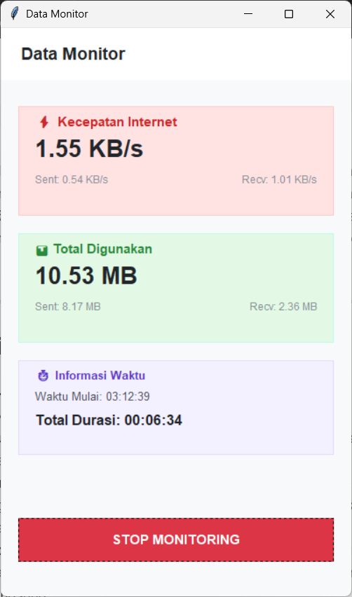

# Internet Data Monitor

Aplikasi desktop berbasis Python (Tkinter) yang berfungsi untuk memantau kecepatan internet (_real-time_) serta mencatat penggunaan total data kuota (_Sent & Received_) sejak tombol monitoring ditekan, lengkap dengan fitur penghitung waktu (_timer_). Tampilan antarmuka didesain modern, bersih, dan minimalis terinspirasi dari aplikasi _mobile data monitor_.

> Preview Aplikasi
>
> <p align="center">
> 

</p>

---

## Fitur Utama

- **Real-time Speed Tracking**: Menampilkan kecepatan unduh (_Download/Receive_) dan unggah (_Upload/Sent_) setiap detik.
- **Accurate Data Counter**: Menghitung total konsumsi data dalam satuan Megabytes (MB) secara presisi sejak tombol mulai ditekan.
- **Smart Timer System**: Mencatat waktu awal mulai (_start time_) dan menghitung durasi berjalan (_elapsed time_). Waktu otomatis akan _pause_ ketika monitoring dihentikan.
- **Responsive UI**: Menggunakan _multithreading_ sehingga antarmuka tetap lancar, responsif, dan tidak membeku (_freeze_) saat proses pencatatan berlangsung.

---

## Persyaratan Sistem

Sebelum menjalankan atau melakukan build pada aplikasi, pastikan komputer Anda sudah terinstal:

- Python 3.x
- PIP (Python Package Installer)

---

## Install

Gunakan perintah berikut untuk menginstal semua pustaka/dependensi pihak ketiga yang diperlukan oleh aplikasi:

```sh
pip install -r requirements.txt
```

> **Catatan:** Modul seperti `tkinter`, `time`, dan `threading` tidak perlu diinstal manual karena sudah termasuk dalam pustaka bawaan standar (_built-in_) Python.

---

## Cara Menjalankan Aplikasi (Development)

Untuk menjalankan aplikasi langsung dari _source code_ Python, buka terminal/CMD di folder proyek lalu jalankan:

```sh
python main.py
```

---

## Build

Anda dapat mengubah skrip Python (`main.py`) menjadi aplikasi mandiri berformat `.exe` agar bisa dijalankan di komputer Windows lain tanpa perlu menginstal Python terlebih dahulu.

### Proses Build .exe

Untuk melakukan _build_ standar (menghasilkan satu file `.exe` tanpa memunculkan jendela hitam CMD):

```sh
pyinstaller --noconsole --onefile main.py
```

### Build dengan Icon

Jika Anda ingin menambahkan berkas icon kustom (pastikan file berformat `.ico`):

```sh
pyinstaller --noconsole --onefile --icon=icon.ico main.py
```

### Build dengan Config `app.spec`

Untuk proses manajemen _build_ yang lebih rapi, terkonfigurasi otomatis, dan profesional, Anda disarankan menggunakan file konfigurasi `app.spec`:

```sh
pyinstaller app.spec
```

> **Informasi Tambahan:** Setelah proses _build_ selesai menggunakan salah satu perintah di atas, file aplikasi siap pakai (`.exe`) Anda akan otomatis tersimpan di dalam folder bernama **`dist/`**.

---

## Struktur Proyek

Berikut adalah struktur folder standar untuk proyek ini:

```text
├── app.spec           # File konfigurasi build PyInstaller
├── icon.ico           # Berkas icon aplikasi (Format Windows Icon)
├── main.py            # Source code utama aplikasi (Tkinter UI & Logika)
├── README.md          # Dokumentasi aplikasi
└── requirements.txt   # Daftar dependensi (psutil)

```

---

Dibuat dengan 💜 menggunakan Python & Tkinter.
